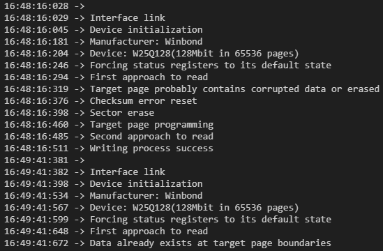

# Description
A simple platform-independent library designed to perform basic operations with serial flash memory devices of the w25qxx family.
## Notes
1. Target page should be erased before data write (minimal erase operation is 1 sector or 16 pages).
2. An external variable `volatile uint32_t uwTick` is used for local delay function and timeouts calculation. It has to be incremented within any timer interrupt routine with t = 1ms or f = 1kHz.
3. To make the use of the library as safe and understandable as possible, any operations with data are performed only starting from the first byte of the page 
(e.g., for the first page the address should be 0, for the second page - 256, etc.).
4. If any device error occurs, most of the driver functionality is blocked. And driver by itself won't try to reset the error.
This approach helps to track down the cause of the error and, by checking the actual status in `w25qxx_Handle.status`, take the right actions to restore the device to working order.   
For example, when trying to read a previously erased page with CRC request, the error `W25QXX_ERROR_CHECKSUM` occurs and other operations will not be available.  
To reset the error there is need to call the `w25qxx_ResetError()` function like this:
```C
w25qxx_Read(&w25qxx_Handle, bufferRead, sizeof(bufferRead), W25QXX_PAGE_TO_ADDRESS
            (TARGET_PAGE), W25QXX_CRC, W25QXX_FASTREAD_NO);
switch (w25qxx_Handle.error)
{
case W25QXX_ERROR_NONE:
    break;

case W25QXX_ERROR_CHECKSUM:
    w25qxx_ResetError(&w25qxx_Handle);
    break;

default:
    Error_Handler();
    break;
}
```
## Features
* Many devices on the same bus are supported with its dedicated handles:
```C
/* First device */
w25qxx_HandleTypeDef w25qxx_Handle1;
w25qxx_Link(&w25qxx_Handle1, w25qxx_SPI1_Receive, w25qxx_SPI1_Transmit,
            w25qxx_SPI1_CS0_Set);
w25qxx_Init(&w25qxx_Handle1);

/* Second device */
w25qxx_HandleTypeDef w25qxx_Handle2;
w25qxx_Link(&w25qxx_Handle2, w25qxx_SPI1_Receive, w25qxx_SPI1_Transmit,
            w25qxx_SPI1_CS1_Set);
w25qxx_Init(&w25qxx_Handle2);

/* Third device */
w25qxx_HandleTypeDef w25qxx_Handle3;
w25qxx_Link(&w25qxx_Handle3, w25qxx_SPI1_Receive, w25qxx_SPI1_Transmit,
            w25qxx_SPI1_CS2_Set);
w25qxx_Init(&w25qxx_Handle3);
```
* Data transfer is carried out by standard SPI instructions, using the CLK, /CS, DI, DO pins.  
* Based on the device ID this library can calculate the number of pages to eliminate some address issues for write/read and erase operations.
* There are several options for waiting for the end of page program/erase instruction with timeouts.
* The built-in ModBus CRC can be used to ensure data integrity.
* Fast read option is implemented in case if SPIclk > 50MHz.
* Device status and error can be controlled within its handle. 
## Supported devices
* w25q80
* w25q16
* w25q32
* w25q64
* w25q128

# Quick start
* Mention the header:
```C
#include "w25qxx.h"
```
* Declare the device handle:
```C
w25qxx_HandleTypeDef w25qxx_Handle;
```
* Declare variable for delay and timeouts: (skip in case of STM32 HAL usage)
```C
volatile uint32_t uwTick;
```
* Increment it within any 1kHz timer routine, e.g.: (skip in case of STM32 HAL usage)
```C
ISR(Timer1kHz_vect) {
  ++uwTick;
}
```
* Initialize SPI periphery and chip select GPIO for each used device, e.g.:
```C
CSx_GPIO_Init();
SPIx_Init();
```
* Provide platform depended implementations for functions below in the `w25qxx_Interface.c`:
```C
w25qxx_Transfer_Status_t w25qxx_SPIx_Receive(uint8_t *pDataRx, uint16_t size, uint32_t timeout);
w25qxx_Transfer_Status_t w25qxx_SPIx_Transmit(uint8_t *pDataTx, uint16_t size, uint32_t timeout);
void w25qxx_SPIx_CSx_Set(w25qxx_CS_State_t newState);
```
* Link the functions above to a device handle:
```C
w25qxx_Link(&w25qxx_Handle, w25qxx_SPIx_Receive, w25qxx_SPIx_Transmit, w25qxx_SPIx_CSx_Set);
```
* Initialize the FLASH device:
```C
w25qxx_Init(&w25qxx_Handle);
```
# Example
Regular demo output:


## References
For application use refer to [`STM32`](./Examples/STM32F401CDU6/Core/Src/main.c), [`Arduino`](./Examples/ArduinoNano/ArduinoNano.ino) or [`RP2040`](./Examples/RP2040/rp2040_w25qxx.c) examples
